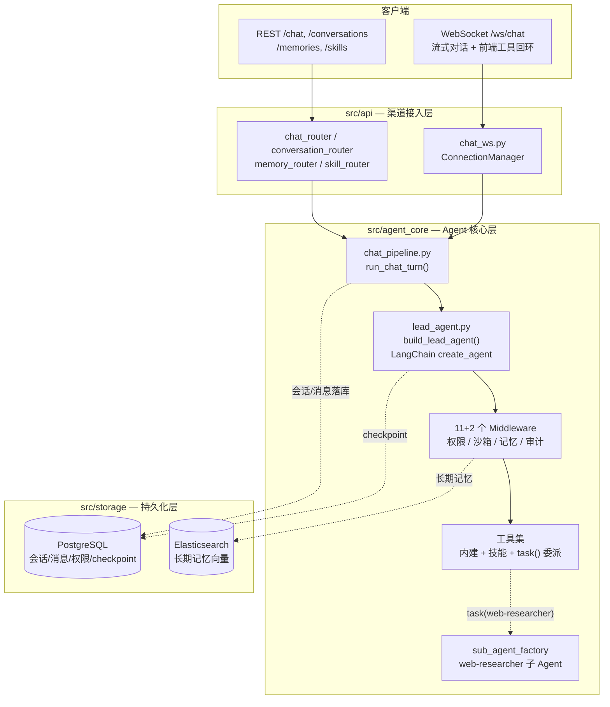
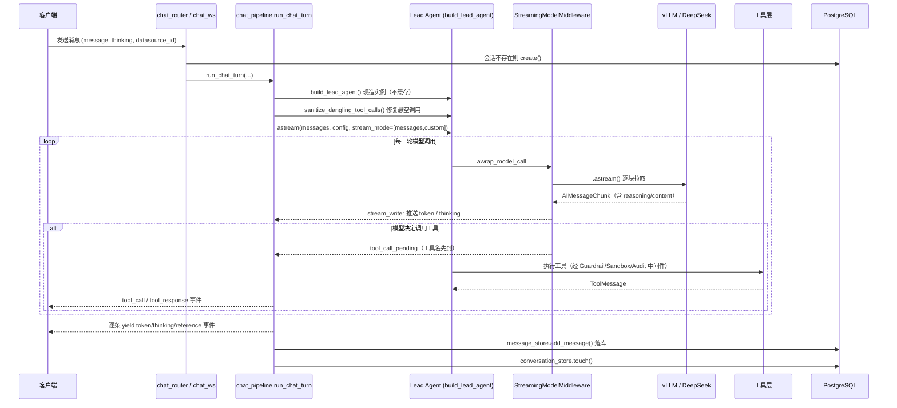
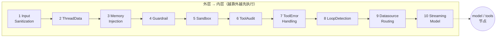
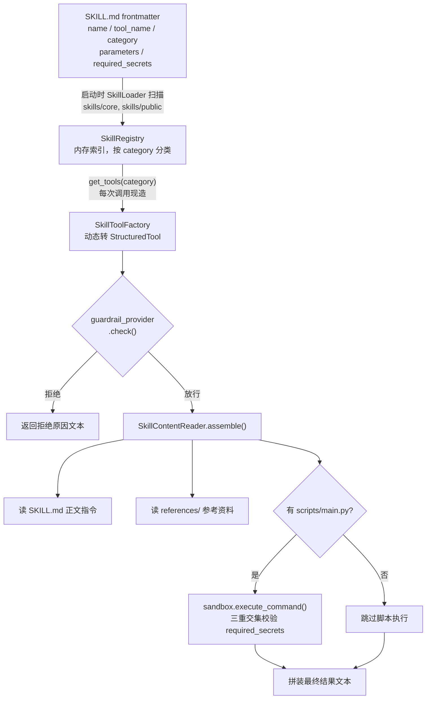
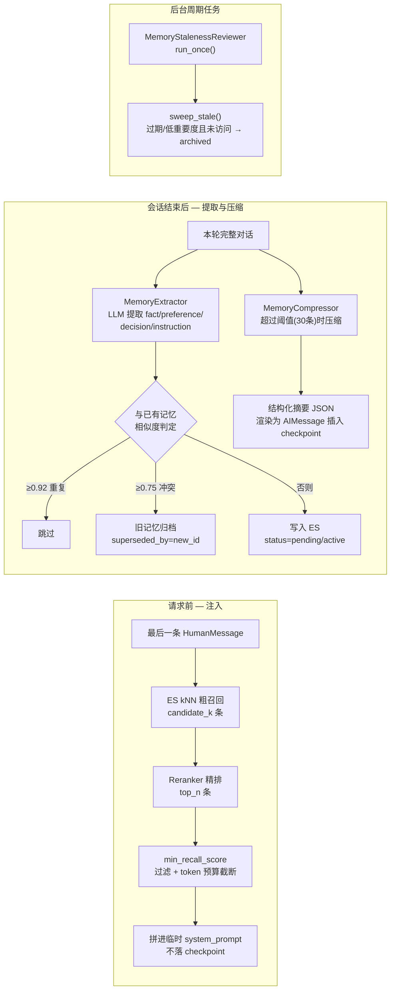

# raster-agent 后端 Agent 架构设计文档

> 版本 v1.0 · 2026-08-06
> 范围：`src/` 全量后端工程
> 依据：源码调研 + `docs/新一代AgentLoop工程设计方案.md`

基于 LangChain 1.x `create_agent` 的单一 Lead Agent + 中间件流水线设计：以可插拔中间件替代多图路由，覆盖权限、沙箱、记忆、审计等横切关注点。

---

## 目录

1. [架构总览](#一架构总览)
2. [应用生命周期](#二应用生命周期)
3. [请求执行链路](#三请求执行链路)
4. [中间件流水线](#四中间件流水线)
5. [委派机制与子 Agent](#五委派机制与子-agent)
6. [模型层](#六模型层)
7. [工具体系](#七工具体系)
8. [Skill 机制](#八skill-机制)
9. [Sandbox 与 Workspace](#九sandbox-与-workspace)
10. [Memory 系统](#十memory-系统)
11. [Storage 层](#十一storage-层)
12. [Guardrail 权限控制](#十二guardrail-权限控制)
13. [Prompt 系统](#十三prompt-系统)
14. [对外 API](#十四对外-api)
15. [目录结构速查](#十五目录结构速查)
16. [设计取舍与已知边界](#十六设计取舍与已知边界)

---

## 一、架构总览

工程分三层：**api**（渠道接入）→ **agent_core**（Agent 能力核心，对应设计文档里的"harness"）→ **storage**（持久化）。核心决策是用 LangChain 1.x 的单一 `create_agent` + 中间件链取代此前的多图 Supervisor 路由，所有横切关注点（权限、沙箱、记忆、审计）收敛为固定顺序的中间件。



*四层拓扑：渠道接入（api）只做协议转换；chat_pipeline 是 REST/WS 共用的驱动层；Lead Agent 由中间件包裹，委派工具是唯一跳出该 Agent 上下文的出口。*

| 目录 | 职责 |
|---|---|
| `src/api/` | 渠道接入层。REST 路由 + WebSocket，只做协议解析/序列化，不含业务逻辑，统一调用 `chat_pipeline.run_chat_turn()`。 |
| `src/agent_core/` | Agent 核心层。对应设计文档中的 "harness"：agents / model / tools / skills / middlewares / memory / guardrail / sandbox / workspace / prompts / eval。 |
| `src/storage/` | 持久化层。PostgreSQL 承载会话元数据、消息副本、权限表、LangGraph checkpoint；Elasticsearch 承载长期记忆向量。 |
| `src/config, schema, common` | 横切基础设施。强类型配置单例、Pydantic 请求/响应模型、统一异常与响应体格式。 |

---

## 二、应用生命周期

`src/main.py` 的 `lifespan` 按严格顺序组装依赖——后一步大多依赖前一步已完成初始化，顺序不可随意调换。

1. **数据库连接池** — `init_database_pool(DATABASE_URL)` 建立全进程唯一 `asyncpg.Pool`，后续所有 Store 共用。
2. **建表 / Store 初始化** — skill_settings、tool_permission、memory_audit、memory_jobs、conversation、message 六张表依次初始化。
3. **Workspace 与 Sandbox** — `init_thread_workspace_manager` 建虚拟工作区管理器；按 `SANDBOX_PROVIDER`（local/docker）二选一初始化沙箱 Provider。
4. **Guardrail Provider** — 组合 skill_settings_store + tool_permission_store，构成权限校验的唯一数据来源。
5. **Skill Manager** — 扫描 `SKILLS_DIRS`（`skills/core,skills/public`），依赖 guardrail + sandbox 已就绪，故必须排在两者之后。
6. **Memory Manager** — 构造 `ElasticsearchMemoryStore` 并 `await setup()`（探测 Embedding/Reranker 可用性），装配 Extractor + Compressor。
7. **Checkpointer** — `AsyncPostgresSaver.from_conn_string(...)` 作为 `async with`，连接生命周期绑定在该块内，贯穿整个应用运行期。
8. **Checkpoint Cleanup** — 依赖 checkpointer 已就绪，登记孤儿数据清理器。
9. **后台维护协程** — `_maintenance_loop()`：周期跑记忆陈旧复核 + checkpoint 孤儿清理，先跑一轮再按 `MAINTENANCE_INTERVAL_HOURS` 休眠，两个子任务各自 try/except 互不影响。
10. **yield — 应用就绪** — 关闭阶段逆序回收：取消维护协程 → 关闭记忆存储 → 关闭 eval/middleware 用的 Redis 连接 → 关闭数据库连接池。

> **中间件与路由注册**：HTTP 层挂载 `EvalMiddleware`（请求级观测，写 Redis Streams，`REDIS_URL` 未配置时静默降级）与 `CORSMiddleware`；路由包括 `health / chat / conversation / memory / skill` 五个 REST router 与一个 WebSocket router。三个全局异常处理器统一对齐 `ApiResponse` 响应体格式。

---

## 三、请求执行链路

`chat_pipeline.py::run_chat_turn()` 是 REST 与 WebSocket 共用的对话轮次驱动逻辑（异步生成器），一次对话请求的完整生命周期如下。



*REST 与 WebSocket 复用同一条链路：REST 丢弃流式事件只取最终结果，WS 把每个事件原样转发给客户端。`stream_mode=["messages","custom"]` 双通道中，正文与思考内容来自 custom 通道（StreamingModelMiddleware 推送），工具执行结果来自 messages 通道。*

### 关键实现细节

- **Lead Agent 不做单例缓存** — 每次请求现造一个新的 `CompiledStateGraph`，构造成本低，换来委派工具列表、技能列表、日期变量始终最新。
- **递归深度** — `recursion_limit` 普通模式 75，深度思考模式 150（`resolve_recursion_limit()`）。
- **引用来源解析** — 维护 `<ref_json>...</ref_json>` 状态机从模型输出中抽取结构化引用；`search_knowledge_base`/`web_search` 工具原始输出还有正则兜底解析。
- **悬空工具调用修复** — `sanitize_dangling_tool_calls()` 处理上次进程崩溃遗留的 "AIMessage.tool_calls 有但 ToolMessage 缺失" 半截状态，避免触发 `INVALID_CHAT_HISTORY`。

---

## 四、中间件流水线

这是本架构相较"多图 Supervisor 路由"最核心的改进：LangGraph 不再手写 `StateGraph`，而是用 `create_agent(model, tools, middleware, ...)` 生成 `model`/`tools` 两个标准节点，全部横切逻辑通过中间件钩子（`abefore_agent` / `abefore_model` / `awrap_model_call` / `awrap_tool_call` / `aafter_agent`）插入，顺序固定、职责单一、可独立测试。



*中间件按注册顺序层层包裹核心节点；`GuardrailMiddleware` 必须排在 `ToolErrorHandlingMiddleware` 之前（权限拒绝是短路而非异常），`StreamingModelMiddleware` 必须在最内层（离真实模型调用最近，保证 `DatasourceRoutingMiddleware` 纠正重试时两次调用都能完整流式输出）。收尾类中间件（Summarization / Title / MemoryExtraction）挂在 `aafter_agent`，图中未画出执行顺序层级。*

| 中间件 | 钩子 | 职责 |
|---|---|---|
| `InputSanitization` | abefore_model | 清洗用户输入的控制字符、多余空白 |
| `ThreadData` | abefore_agent | 获取/创建会话隔离工作区（`ThreadWorkspace`） |
| `MemoryInjection` | awrap_model_call | 检索长期记忆，临时拼进本次调用的 system_prompt（不落 checkpoint） |
| `Guardrail` ⚠️关键顺序 | awrap_tool_call | 工具调用前置权限校验，覆盖全部工具，拒绝返回 error ToolMessage 而非抛异常 |
| `Sandbox` | awrap_tool_call | 获取/释放沙箱实例（Local 或 Docker） |
| `ToolAudit` | awrap_tool_call | 工具调用起止时间、耗时、状态日志 |
| `ToolErrorHandling` | awrap_tool_call | 工具异常统一转为 error ToolMessage，避免整轮中断 |
| `LoopDetection` | abefore_model | 连续 3 次相同调用短路，防止死循环 |
| `Summarization` | aafter_agent | 会话结束后按阈值（默认 30 条）压缩历史 |
| `Title` | aafter_agent | 首轮结束后异步生成会话标题 |
| `MemoryExtraction` | aafter_agent | 会话结束后 fire-and-forget 异步提取长期记忆 |
| `DatasourceRouting` 业务专属 | awrap_model_call | `datasource_id` 已配置但模型未调用 `query_database` 时注入纠正提示重试一次 |
| `StreamingModel` ⚠️关键顺序 | awrap_model_call | 绕开内置 `ainvoke`，改用 `.astream()` 逐块拉取并推送 custom 通道 |

前 11 个中间件由 `agent_core/loop.py::build_middlewares()` 统一组装，是可复用的通用流水线；后两个（`DatasourceRouting`/`StreamingModel`）是 `lead_agent.py` 专属追加项——前者因为知道具体工具名 `query_database`，与技能命名耦合，不适合放进通用流水线。

---

## 五、委派机制与子 Agent

从早期"三个固定委派工具"演进为通用 `task(subagent_type, task)` 分发。

| 能力 | 接入方式 | 原因 |
|---|---|---|
| `search_knowledge_base`（RAG） | 直接挂载 Lead Agent 基础工具集 | 委派子 Agent 执行结果对外层不可见，会让 chat_pipeline 的引用解析拿不到数据 |
| `query_database` | 直接挂载 Lead Agent 基础工具集 | 同上，且需要 `DatasourceRoutingMiddleware` 硬校验 |
| `web-researcher` | task() 委派子 Agent | 仍需要"多轮判断再回话"的独立推理过程 |

### 执行内核

`delegation_tools.py::build_task_tool()` 构造 `StructuredTool(name="task")`，按 `subagent_type` 从 `subagent_profiles.py` 注册表查表拿到 `system_prompt`/`tools`，交给 `sub_agent_factory.py::run_subagent()` 执行——现造一个**不挂载任何中间件、不带 checkpointer** 的临时 `create_agent`，只透传 `config["configurable"]`（不透传 callbacks，避免子 Agent 内部事件泄漏进外层流），取最后一条 `AIMessage` 文本作为结果返回。

> **安全边界**：子 Agent 工具集绝不能包含沙箱执行类工具（`write_file`/`read_file`/`run_python`/`run_command`），否则会绕开 Lead Agent 层的死循环检测和权限校验。

---

## 六、模型层

`model_factory.py::create_chat_model()` 是无状态工厂函数，每次调用现造实例、不缓存单例，按供应商分流到对应的 Patched 子类。

| 供应商 | 返回类型 | 特殊处理 |
|---|---|---|
| DeepSeek | `PatchedChatDeepSeek` | `extra_body.thinking.type` 控制思考开关；`httpx.Client(trust_env=False)` 避免误走本地代理；重写 `_get_request_payload()` 把 `reasoning_content` 按位置回填进请求体，修复多轮思维链续接 |
| vLLM / Qwen | `PatchedChatOpenAI` | Qwen 模型注入 `extra_body.chat_template_kwargs.enable_thinking`；三级优先级解析思考内容 |
| 其余供应商 | LangChain 通用 `init_chat_model()` | 标准路径，无定制 |

### 思考内容（reasoning）三种服务端形态

这是一次实测排查沉淀下来的关键知识：同一套 Qwen 模型部署，经过的网络路径不同，返回的思考内容字段形态完全不同。`PatchedChatOpenAI` 按以下优先级依次尝试，统一写回 `additional_kwargs["reasoning_content"]`，下游只需认一个字段名：

1. `delta.reasoning` / `message.reasoning` — 直连 vLLM 原生端口、`--reasoning-parser qwen3` 生效且生成完整跑完时的真实形态
2. `reasoning_content` 字段 — 部分 OpenAI 兼容供应商的习惯用法
3. `<think>...</think>` 标签混在 `content` 字符串里 — 经过纯转发 middleware 中间层时的黑盒行为，需要状态机跨 chunk 缓冲解析（`_think_buffer` / `_in_think_block`）

> **模型选择优先级**：显式传入的 `model` 参数最优先；未传时若 `thinking_enabled` 且配置了 `OPENAI_MODEL_THINKING` 则切到独立思考模型；否则退回 `DEFAULT_MODEL`。

---

## 七、工具体系

没有集中式"工具注册表"，而是在 `lead_agent.py::build_lead_agent()` 里分层拼装。

```python
base_tools = [
    save_memory, recall_memory,               # 内部工具（不推前端/不落库）
    write_file, read_file, run_python,
    run_command, save_output_file,            # 沙箱工具
    *skill_manager.get_tools("general"),
    *skill_manager.get_tools("tool"),
    *skill_manager.get_tools("rag"),
    *skill_manager.get_tools("database"),
    *(extra_tools or []),                     # 前端注入的自定义工具
    build_task_tool(),                        # 通用委派分发
]
```

| 文件 | 职责 |
|---|---|
| `web_search_tool.py` | `TavilySearchClient` 薄封装，调用 Tavily API 并格式化【摘要】【来源】文本 |
| `rag_service.py` | `RAGService`（检索 + 引用要求）+ `RAGQueryRewriteService`（对话式问题改写），实际工具入口在 `skills/core/search-knowledge-base/` |
| `database_tool.py` | `DatabaseQueryService` 两阶段查询 + LLM 生成分析/解读/图表元数据，实际工具入口在 `skills/core/query-database/` |
| `sandbox_tool.py` | 文件读写与命令执行，每次调用现取 `sandbox_provider.acquire()` |
| `memory_tools.py` | `save_memory` / `recall_memory`，需配合 `tool_filter_registry` 隐藏 |
| `custom_tool_converter.py` | 把前端通过 WebSocket 声明的 MCP JSON Schema 转成 `StructuredTool`，执行经 WS 往返客户端，15s 超时 |
| `tool_filter.py` | `ToolFilterRegistry` 全局单例，工具名黑名单，标记不推前端/不落库的内部工具 |

---

## 八、Skill 机制

采用"渐进式披露"架构：启动阶段只解析 frontmatter 元数据，运行时才读正文/跑脚本，避免所有技能说明书一次性塞进系统提示词。



*两级披露：加载阶段只读 frontmatter（元数据），调用阶段才读正文/参考资料/执行脚本。`required_secrets` 密钥注入遵循"技能声明需要 × 调用方提供 × Guardrail 放行"三重交集规则，绝不进 prompt/日志/checkpoint。*

| 目录 | 内容 |
|---|---|
| `skills/core/` | 内置技能：`query-database`、`search-knowledge-base` |
| `skills/public/` | 社区技能：`chart-visualization`、`data-analysis`、`deep-research`、`image-generation`、`skill-creator` 等 |

关键组件：`SkillLoader`（扫描）→ `SkillRegistry`（内存索引）→ `SkillManager`（唯一对外入口 `get_tools(category)`）→ `SkillToolFactory`（frontmatter `parameters` 动态生成 Pydantic `args_schema`）→ `SkillContentReader`（拼装指令 + 参考资料 + 脚本结果）。文件浏览能力（供前端懒加载展示技能目录）由 `SkillFileTreeReader` 提供，复用 `PathGuard` 做路径穿越校验。

---

## 九、Sandbox 与 Workspace

凡是需要读写文件、跑代码/脚本的能力（含脚本型技能），统一经过 Sandbox 抽象层，获得虚拟路径隔离、资源限制、执行审计。

| 实现 | 执行机制 | 已知限制 |
|---|---|---|
| `LocalSandbox` | 宿主机子进程（`subprocess.Popen` + `asyncio.to_thread`），cwd 固定为会话 workspace 目录，环境变量经 `env_policy` 清洗 | POSIX 下 `RLIMIT_AS` 限制内存，Windows 无此防护 |
| `DockerSandbox` | 一次性 `--rm` 容器执行命令，文件操作委托给内部 `LocalSandbox` | 默认镜像不含 Node.js；暂不支持 stdin 管道 |

两者都通过 `SandboxProvider`（`acquire`/`release`）抽象与 `sandbox_registry.py` 全局单例解耦，启动时按 `SANDBOX_PROVIDER` 配置项二选一。

### Workspace 隔离

`ThreadWorkspace` 以 `conversation_id`（即 `thread_id`）为粒度隔离每个会话的工作目录，工具内统一用虚拟路径访问，由 Sandbox 层做真实路径映射到宿主机/容器内路径。

---

## 十、Memory 系统

三层记忆体系：短期记忆即 LangGraph checkpoint 完整消息历史；长期记忆是跨会话的 Elasticsearch 向量存储；两者之间由压缩机制衔接。



*注入路径是同步的、请求内联的（`MemoryInjectionMiddleware`）；提取与压缩是异步的、会话收尾后 fire-and-forget（`MemoryExtractionMiddleware` / `SummarizationMiddleware`）；陈旧复核是独立于单次会话的全局后台任务。*

### 关键设计点

- **摘要以 AIMessage 插入** — 而非 SystemMessage，因为 Qwen/vLLM 的 chat template 要求 system 消息必须在最前面。
- **敏感信息拦截** — `save()`/`update()` 前经 `contains_sensitive_info()` 正则规则检测（API key、连接串、身份证、银行卡等）。
- **降级策略** — Reranker 调用失败时降级为纯 kNN 排序结果；审计写入失败静默降级，不拖垮主流程。
- **陈旧归档非物理删除** — `sweep_stale()` 全量扫描（不分 user_id），归档条件满足任一：`expires_at` 已过期，或重要度低于阈值且访问次数为 0 且创建时间早于 `max_age_days`。

---

## 十一、Storage 层

统一使用 PostgreSQL + asyncpg 连接池，Agent 推理状态用 LangGraph `AsyncPostgresSaver`（同一个 `DATABASE_URL`，独立管理 `checkpoints`/`checkpoint_blobs`/`checkpoint_writes` 三张表）。

| Store | 表名 | 职责 |
|---|---|---|
| `conversation_store.py` | `conversations` | 会话元数据 |
| `message_store.py` | `conversation_messages` | REST 历史查询用的冗余消息副本（含 thinking/tool_calls/references），与 checkpointer 独立维护 |
| `memory_audit_store.py` | `memory_audit_logs` | 记忆操作审计日志（辅助能力，失败静默降级） |
| `memory_jobs_store.py` | `memory_jobs` | 记忆后处理任务状态流转，供崩溃恢复 |
| `skill_settings_store.py` | `user_skill_settings` | 按用户技能禁用记录（只存禁用，默认全开） |
| `tool_permission_store.py` | `user_tool_permissions` | 按用户工具级权限拒绝记录 |

### checkpoint 孤儿数据清理

背景：会话删除操作曾经只清理 `conversations`/`conversation_messages`，从未通知 checkpointer，导致三张 LangGraph 内部表产生孤儿数据。现在的处理方式：

- **即时清理** — `delete_for_thread(thread_id)` 已接入 `conversation_router::delete_conversation`，会话删除时同步调用 `checkpointer.adelete_thread()`。
- **兜底扫描** — `cleanup_orphans(limit=500)` 全量扫描 checkpoints 表中找不到对应 conversation 的 `thread_id`，由后台维护循环周期调用，处理历史遗留及未来可能遗漏的删除路径。

---

## 十二、Guardrail 权限控制

`GuardrailProvider.check(user_id, tool_name, tool_args, context) → GuardrailDecision`（ALLOW/DENY + reason）。拒绝时返回文本说明而非抛异常——"这次不能做"不是"系统出错"，与 Skill/工具体系"失败不中断"的容错哲学一致。

| 校验来源 | 粒度 | 命中规则 |
|---|---|---|
| `SkillSettingsStore.is_disabled()` | 技能级开关 | 用户主动关闭的技能 |
| `ToolPermissionStore.is_denied()` | 工具级权限 | 更广义的拒绝记录，预留 scope 字段支持细粒度授权 |

**任一命中拒绝即整体拒绝**，都未命中默认放行；无 `user_id`（内部调用/测试场景）或权限存储查询异常时也默认放行（记 warning，不让"查权限"本身拖垮对话）。

### 挂载点

双重覆盖：通用中间件 `GuardrailMiddleware`（`awrap_tool_call`，覆盖全部工具）+ `SkillToolFactory._invoke` 内部一次调用（历史上早于通用中间件引入，逻辑一致，是补充覆盖面而非替代）。

> **与 DatasourceRoutingMiddleware 的区别**：后者不是权限校验，是业务规则强制（`datasource_id` 已配置但未调用 `query_database` 时纠正重试），因此不进入 Guardrail 体系，作为 `lead_agent.py` 专属中间件单独挂载。

---

## 十三、Prompt 系统

两套并行机制，职责不同：系统提示词做模块化开关组装，业务提示词做静态模板渲染。

### 系统提示词 — SystemPromptBuilder

按固定顺序拼装 `system/lead_agent/` 下的模块片段，每个非 `role` 模块有同名布尔开关，关闭时整段（含标签）跳过，不留空壳：

```
role (永远注入)
→ thinking_style   [thinking_enabled]
→ clarification_system [clarification_enabled]
→ skill_system     [skill_enabled]
→ subagent_system  [subagent_enabled]
→ response_style   [response_style_enabled]
```

### 业务提示词模板 — PromptFactory

`templates/*.md` 静态模板，`PromptLoader` 扫描产出 `PromptRegistry`；`PromptFactory.render(name, **variables)` 用 `str.format()` 渲染，缺变量抛 `PromptRenderError`（比裸 `KeyError` 更易定位）。覆盖标题生成、web 搜索子 Agent、RAG 查询改写、数据库分析/解读、图表元数据生成等场景。

---

## 十四、对外 API

### REST

| 路径 | 方法 | 功能 |
|---|---|---|
| `/health` | GET | 健康检查 |
| `/chat` | POST | 非流式对话（内部仍走 run_chat_turn，丢弃事件只取最终结果） |
| `/conversations` | POST / GET | 创建会话 / 按用户列出会话 |
| `/conversations/{id}/messages` | GET | 查询会话历史消息 |
| `/conversations/{id}` | PUT / DELETE | 改标题 / 删除会话（含 checkpoint 数据） |
| `/conversations/{id}/outputs/{path}` | GET | 下载会话产物文件 |
| `/memories` | GET / POST | 列出 / 新增长期记忆 |
| `/memories/search` | POST | 语义检索长期记忆 |
| `/memories/{id}` | PUT / DELETE | 编辑 / 删除记忆 |
| `/memories/{id}/audit-logs` | GET | 记忆操作审计记录 |
| `/skills` | GET | 列出全部技能（含用户启用状态） |
| `/skills/{name}` | GET | 技能详情（含 SKILL.md 正文） |
| `/skills/{name}/tree`, `/file` | GET | 技能目录树懒加载 / 读取文件原文 |
| `/skills/{name}/toggle` | PUT | 用户级启用/禁用技能 |

### WebSocket

`/ws/chat` 单一端点承载全部流式交互：服务端下行事件类型为 `start / token / thinking / tool_call / skill_call / tool_response / skill_response / reference / done / error`；前端自定义工具执行结果通过 `ConnectionManager` 的"发指令-等结果"往返机制回传。

---

## 十五、目录结构速查

```
src/
├── main.py                    # FastAPI 入口 + lifespan 组装
├── agent_core/                # Agent 能力核心（对应设计文档"harness"）
│   ├── agents/                # chat_pipeline / lead_agent / delegation_tools
│   │                          # sub_agent_factory / subagent_profiles
│   │                          # streaming_model_middleware / datasource_routing_middleware
│   ├── model/                 # model_factory / patched_vllm / patched_deepseek
│   ├── tools/                 # web_search / rag_service / database_tool / sandbox_tool
│   ├── skills/                # skill_manager / loader / registry / tool_factory
│   ├── middlewares/           # 11 个通用中间件 + context.py + state.py
│   ├── memory/                # memory_manager / extractor / compressor
│   │                          # staleness_reviewer / elasticsearch_memory_store
│   ├── guardrail/             # guardrail_provider / allowlist_guardrail_provider
│   ├── sandbox/                # local_sandbox / docker_sandbox / sandbox_registry
│   ├── workspace/              # thread_workspace / path_guard
│   ├── prompts/                # system_prompt_builder / prompt_factory
│   └── eval/                   # emitter / http_middleware（Redis Streams 埋点）
├── api/                        # router/（REST）+ websocket/（chat_ws）
├── storage/                    # 各类 Store + database.py + checkpoint_cleanup.py
├── config/                     # settings.py（pydantic-settings 单例）
├── schema/                     # Pydantic 请求/响应模型
├── common/                     # constants / exceptions / response
└── utils/                      # user_utils / uuid_utils

skills/
├── core/                       # query-database, search-knowledge-base
└── public/                     # chart-visualization, data-analysis, deep-research 等
```

---

## 十六、设计取舍与已知边界

### 为什么放弃 Supervisor 多图路由

此前架构是"一个 `StateGraph` 挂 5 个子节点，Supervisor 节点每轮用 LLM 输出 JSON 决定路由"。三个结构性问题促成重做：没有统一的运行时外壳（横切逻辑分散在手写胶水代码里）、没有文件系统沙箱（技能设计初衷需要但实际是裸 `subprocess.Popen`）、没有权限控制（`user_id` 由前端直传，无校验）。参考 ByteDance DeerFlow 2.0 的"单一 Agent + Middleware Pipeline"骨架形状，但不照搬其多渠道接入、K8s Provisioner 等超出当前业务规模的复杂度。

### 已知边界

- **用户身份认证尚未落地** — `user_id` 仍由前端直接传入，服务端不做身份校验，是路线图中唯一未完成项。
- **ReadBeforeWriteMiddleware 尚未实现** — 写文件前应先读过、内容哈希未变才允许写，DeerFlow 有此设计但本工程仍是待办。
- **记忆冲突检测覆盖有限** — 目前只做相似度阈值判定归档，更复杂的语义冲突检测未覆盖。
- **Windows 沙箱资源限制缺失** — `LocalSandbox` 的内存限制（`RLIMIT_AS`）只在 POSIX 生效。
- **DockerSandbox 功能子集** — 默认镜像不含 Node.js，暂不支持 stdin 管道。

---

*raster-agent 架构设计文档 · 基于源码调研（2026-08-06）与 `docs/新一代AgentLoop工程设计方案.md` 交叉整理*
