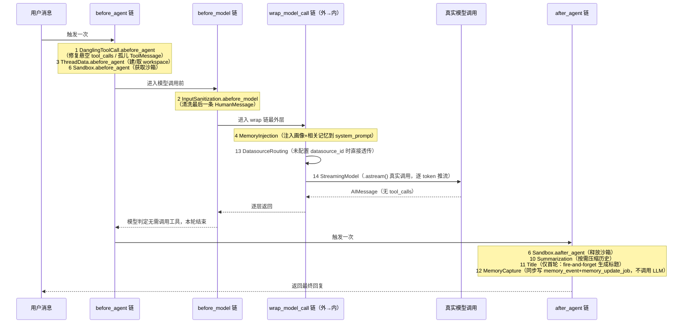
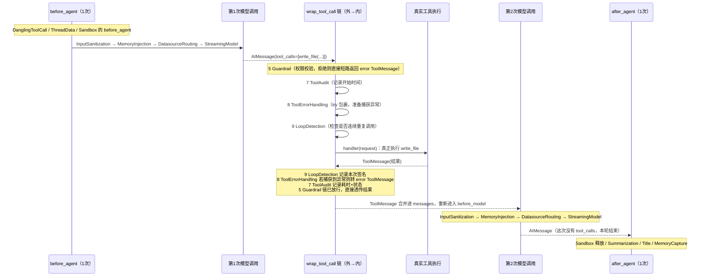

# 中间件洋葱模型说明

> 范围：`agent_core/loop.py::build_middlewares()` 组装的 12 个通用中间件 + `agent_core/agents/lead_agent.py` 追加的 2 个 Lead Agent 专属中间件，共 14 个。
> 前置阅读：`docs/新一代AgentLoop工程设计方案.md` 第四、五节（架构动机），本文档只讲"这些中间件按什么顺序加载、一轮对话里按什么顺序执行"。

---

## 一、先厘清一个容易搞混的点：中间件不是只跑一次

`create_agent(middleware=[...])` 编译出的是一张 LangGraph 图，一次 `.ainvoke()`/`.astream()` 调用（对应用户发一句话、Agent 可能经过若干轮"模型输出 tool_calls → 执行工具 → 再喂回模型"，直到模型不再调用工具为止）会：

- 触发 **1 次** `before_agent`/`after_agent`（整次运行的头和尾）；
- 触发 **N 次** `before_model`/`wrap_model_call`（N = 模型被调用的次数，简单问答 N=1，多轮工具调用 N>1）；
- 触发 **M 次** `wrap_tool_call`（M = 本轮实际发生的工具调用总数，可能为 0）。

`agent_core/middlewares/` 下每个类只声明自己关心的钩子（大多数中间件只实现其中一个），框架按中间件在列表里的位置把同名钩子串成一条链。这条链的包裹关系就是"洋葱模型"：列表里**靠前的中间件在最外层**。

```
                        ┌─────────────────────────────────────────┐
                        │  DanglingToolCall  (最外层)               │
                        │ ┌───────────────────────────────────────┐│
                        │ │  InputSanitization                    ││
                        │ │ ┌─────────────────────────────────────┤│
                        │ │ │  ThreadData                         ││
                        │ │ │ ┌───────────────────────────────────┤│
                        │ │ │ │  MemoryInjection                  ││
                        │ │ │ │ ┌─────────────────────────────────┤│
                        │ │ │ │ │  Guardrail                      ││
                        │ │ │ │ │ ┌───────────────────────────────┤│
                        │ │ │ │ │ │  Sandbox                      ││
                        │ │ │ │ │ │ ┌─────────────────────────────┤│
                        │ │ │ │ │ │ │ ToolAudit                   ││
                        │ │ │ │ │ │ │┌────────────────────────────┤│
                        │ │ │ │ │ │ ││ ToolErrorHandling           ││
                        │ │ │ │ │ │ ││┌───────────────────────────┤│
                        │ │ │ │ │ │ │││ LoopDetection              ││
                        │ │ │ │ │ │ │││  (真正执行工具的地方)       ││
                        │ │ │ │ │ │ │└───────────────────────────┘│
                        │ │ │ │ │ │ └─────────────────────────────┘│
                        │ │ │ │ │ └───────────────────────────────┘│
                        │ │ │ │ └─────────────────────────────────┘│
                        │ │ │ └───────────────────────────────────┘│
                        │ │ └─────────────────────────────────────┘│
                        │ └───────────────────────────────────────┘│
                        └─────────────────────────────────────────┘
```

上图只是示意"外层包内层"的关系，实际每个中间件只挂自己需要的钩子——`before_agent`/`after_agent` 一条链，`wrap_model_call` 一条链，`wrap_tool_call` 又是一条链，三条链各自独立按顺序嵌套，不要理解成"14 层无差别嵌套"。下一节按四类钩子分别列出真正参与该链路的中间件。

---

## 二、14 个中间件总览

| # | 中间件 | 所在文件 | 挂载的钩子 | 一次运行触发几次 |
|---|---|---|---|---|
| 1 | `DanglingToolCallMiddleware` | `middlewares/dangling_tool_call.py` | `abefore_agent` | 1 次（运行最开始） |
| 2 | `InputSanitizationMiddleware` | `middlewares/input_sanitization.py` | `abefore_model` | 每次模型调用前 |
| 3 | `ThreadDataMiddleware` | `middlewares/thread_data.py` | `abefore_agent` | 1 次（运行最开始） |
| 4 | `MemoryInjectionMiddleware` | `middlewares/memory_injection.py` | `awrap_model_call` | 每次模型调用 |
| 5 | `GuardrailMiddleware` | `middlewares/guardrail.py` | `awrap_tool_call` | 每次工具调用 |
| 6 | `SandboxMiddleware` | `middlewares/sandbox_middleware.py` | `abefore_agent` + `aafter_agent` | 1 次 + 1 次（运行首尾） |
| 7 | `ToolAuditMiddleware` | `middlewares/tool_audit.py` | `awrap_tool_call` | 每次工具调用 |
| 8 | `ToolErrorHandlingMiddleware` | `middlewares/tool_error_handling.py` | `awrap_tool_call` | 每次工具调用 |
| 9 | `LoopDetectionMiddleware` | `middlewares/loop_detection.py` | `awrap_tool_call` | 每次工具调用 |
| 10 | `SummarizationMiddleware` | `middlewares/summarization.py` | `aafter_agent` | 1 次（运行结束） |
| 11 | `TitleMiddleware` | `middlewares/title.py` | `aafter_agent` | 1 次（运行结束，仅首轮触发实际逻辑） |
| 12 | `MemoryCaptureMiddleware` | `middlewares/memory_capture.py` | `aafter_agent` | 1 次（运行结束） |
| 13 | `DatasourceRoutingMiddleware`* | `agents/datasource_routing_middleware.py` | `awrap_model_call` | 每次模型调用 |
| 14 | `StreamingModelMiddleware`* | `agents/streaming_model_middleware.py` | `awrap_model_call` | 每次模型调用 |

\* 13、14 不在 `build_middlewares()` 的 12 个通用中间件之列，是 `lead_agent.py` 组装时手动追加在列表末尾的 Lead Agent 专属中间件（见 `datasource_routing_middleware.py` 模块文档："不属于 `agent_core/middlewares/` 里那 11 个通用中间件"）。

---

## 三、加载顺序：代码里怎么组装的

顺序完全由两处列表字面量决定，**不存在运行期重排**：

### 3.1 `agent_core/loop.py::build_middlewares()`（12 个通用中间件中的前 12 个位置）

```python
return [
    DanglingToolCallMiddleware(),      # 1
    InputSanitizationMiddleware(),     # 2
    ThreadDataMiddleware(...),         # 3
    MemoryInjectionMiddleware(...),    # 4
    GuardrailMiddleware(...),          # 5
    SandboxMiddleware(...),            # 6
    ToolAuditMiddleware(),             # 7
    ToolErrorHandlingMiddleware(),     # 8
    LoopDetectionMiddleware(...),      # 9
    SummarizationMiddleware(...),      # 10
    TitleMiddleware(...),              # 11
    MemoryCaptureMiddleware(...),      # 12
]
```

### 3.2 `agent_core/agents/lead_agent.py::build_lead_agent()`（在上面 12 个之后追加 2 个）

```python
middlewares = [
    *build_middlewares(...),           # 上面 12 个，原样展开
    DatasourceRoutingMiddleware(),     # 13
    StreamingModelMiddleware(),        # 14，必须是最内层
]
```

顺序不是随意排的，`loop.py` 模块文档和各中间件文档里写死了三条硬约束：

1. **Guardrail 必须排在 ToolErrorHandling 之前**（即列表位置更靠前 → 洋葱外层）。权限拒绝是"短路，根本不执行 handler"，`ToolErrorHandling` 包裹的是"执行过程中抛出的异常"，两者是不同职责的两层包装，顺序颠倒会导致一个被 Guardrail 拒绝的调用先被 `ToolErrorHandling` 当成"异常"处理，语义错乱。
2. **`StreamingModelMiddleware` 必须是最内层**（离真实模型调用最近）。它用 `.astream()` 整个替换掉框架默认的 `handler`（不调用传入的 `handler`，自己发起真实请求），如果外面还有别的 `wrap_model_call` 中间件排在它后面（更内层），那个中间件永远等不到被调用的机会。
3. **`DatasourceRoutingMiddleware` 必须排在 `StreamingModelMiddleware` 之前**（更外层）。它在必要时会用同一个 `handler` **重试一次**模型调用（详见下节时序图），`handler` 实际指向的正是 `StreamingModelMiddleware.awrap_model_call`——这样重试的两次调用才会各自完整走一遍真流式输出，而不是只有第一次是流式。

### 3.3 沙箱工具为什么直接挂在 Lead Agent 工具集，而不是包成委派工具

`lead_agent.py` 模块文档特别说明了这一点：`write_file`/`read_file`/`run_python`/`run_command` 挂在 Lead Agent 自己的 `tools` 列表（而不是包装成"派给子 Agent 执行"的委派工具），是因为委派工具背后的子 Agent（`sub_agent_factory.py`）**不挂任何中间件**。如果"写代码 → 跑 → 改 → 再跑"这类迭代循环发生在子 Agent 内部，会完全跑在 `LoopDetectionMiddleware`（死循环检测）和 `GuardrailMiddleware`（权限校验）之外。放在 Lead Agent 自己的工具集里，每一次调用都会经过下面第四节描述的完整 `wrap_tool_call` 链。

---

## 四、一轮对话的执行时序

"一轮对话"指用户发一句话，到 Agent 最终给出不再调用工具的回复为止，中间可能经过 0 次或多次工具调用。下面分两种情况画出完整时序：**不触发工具调用**（最简单的问答）和**触发一次工具调用**（更能体现洋葱模型的嵌套关系）。

### 4.1 情况一：模型直接回答，不调用任何工具



### 4.2 情况二：模型触发一次工具调用（例如 `write_file`）

这种情况下 `wrap_tool_call` 链会完整地插入到"模型第一次响应"和"模型第二次响应"之间，是洋葱模型体现得最完整的场景。



**关键点**：`wrap_tool_call` 链（Guardrail → ToolAudit → ToolErrorHandling → LoopDetection）是**每一次工具调用**都会完整跑一遍的，如果一轮对话里模型连续调用了 3 次工具（比如"写文件 → 跑代码 → 看报错"），这条链会完整执行 3 遍，而 `before_agent`/`after_agent` 全程只在最外层各触发 1 次。

### 4.3 `wrap_tool_call` 链的洋葱包裹关系（放大 4.2 中的 WT 部分）

```
用户发起 write_file 调用
    │
    ▼
┌─── 5 GuardrailMiddleware ─────────────────────────────┐  外层：先判权限
│  decision = guardrail_provider.check(...)              │
│  拒绝 → 直接 return error ToolMessage（不进入内层）      │
│  放行 → 调用 handler(request) 进入下一层                 │
│  ┌─── 7 ToolAuditMiddleware ────────────────────────┐  │
│  │  记录 started_at，调用 handler，记录 duration_ms    │  │
│  │  ┌─── 8 ToolErrorHandlingMiddleware ────────────┐ │  │
│  │  │  try: return await handler(request)          │ │  │
│  │  │  except: 转成 error ToolMessage（不再上抛）     │ │  │
│  │  │  ┌─── 9 LoopDetectionMiddleware ────────────┐ │ │  │
│  │  │  │  连续重复达阈值 → 短路返回提示，不执行       │ │ │  │
│  │  │  │  否则 → 调用 handler(request)             │ │ │  │
│  │  │  │  ┌─── 真正的工具函数（write_file 等）───┐ │ │ │  │
│  │  │  │  │        实际写文件 / 跑代码           │ │ │ │  │
│  │  │  │  └───────────────────────────────────┘ │ │ │  │
│  │  │  └──────────────────────────────────────┘ │ │  │
│  │  └────────────────────────────────────────┘ │  │
│  └──────────────────────────────────────────┘  │
└────────────────────────────────────────────┘
```

这解释了为什么顺序不能颠倒：如果 `LoopDetection` 排在 `Guardrail` 外层，一个原本会被权限拒绝的调用也会先被计入"重复调用历史"；如果 `ToolErrorHandling` 排在 `Guardrail` 内层（当前就是这样），`Guardrail` 的拒绝路径根本不会经过 `ToolErrorHandling`（因为它直接短路返回，不调用 `handler`），这正是 `loop.py` 文档强调的"拒绝短路"和"执行异常包裹"是两层不同职责的具体体现。

---

## 五、`wrap_model_call` 链的洋葱包裹关系

一次模型调用（`before_model` 触发之后）会依次经过：

```
┌─── 4 MemoryInjectionMiddleware ───────────────────────────┐  外层：先拼 system_prompt
│  检索长期记忆（画像在前、相关 Facts 在后），合并进 system_prompt│
│  调用 handler(request) 进入下一层                            │
│  ┌─── 13 DatasourceRoutingMiddleware ─────────────────────┐ │
│  │  response = await handler(request)  ← 第一次真实调用       │ │
│  │  若配置了 datasource_id 但模型未调用 query_database：       │ │
│  │    注入纠正提示，再调用一次 handler(request) ← 第二次调用    │ │
│  │  ┌─── 14 StreamingModelMiddleware ───────────────────┐  │ │
│  │  │  .astream() 真实请求模型，逐 token 推流               │  │ │
│  │  │  汇总成完整 AIMessage 返回                            │  │ │
│  │  └──────────────────────────────────────────────────┘  │ │
│  └────────────────────────────────────────────────────┘ │
└──────────────────────────────────────────────────────┘
```

`DatasourceRoutingMiddleware` 是这条链里唯一可能让 `handler`（也就是 `StreamingModelMiddleware`）被调用两次的中间件——两次都会各自完整流式输出一遍，这是 `streaming_model_middleware.py` 模块文档里特别提到的"纠正重试机制本身'两次真实模型调用'的语义"，不是额外引入的行为。

---

## 六、`before_agent`/`after_agent` 链：只在整轮运行的头尾各跑一次

容易和"每次模型调用"搞混的是：`before_agent`/`after_agent` **不会**在多轮工具调用之间重复触发，只在整个 `.ainvoke()`/`.astream()` 调用的最开始和最结束各触发一次。挂载这两个钩子的中间件：

| 阶段 | 中间件 | 做的事 |
|---|---|---|
| `before_agent`（进入顺序） | 1 DanglingToolCall | 修复历史消息里悬空的 `tool_calls`/孤儿 `ToolMessage` |
| `before_agent`（进入顺序） | 3 ThreadData | 获取/创建本会话的隔离工作区（`ThreadWorkspace`），存为实例私有属性 |
| `before_agent`（进入顺序） | 6 Sandbox | 获取本会话的沙箱实例，存为实例私有属性 |
| `after_agent`（进入顺序） | 6 Sandbox | 释放本次获取的沙箱实例 |
| `after_agent`（进入顺序） | 10 Summarization | 按消息数量/token 阈值判断是否需要压缩历史 |
| `after_agent`（进入顺序） | 11 Title | 仅当本轮是"第一轮"（`HumanMessage` 计数 == 1）时，fire-and-forget 生成会话标题 |
| `after_agent`（进入顺序） | 12 MemoryCapture | 在同一数据库事务内写 `memory_event`+`memory_update_job`（不调用 LLM，语义判断交给常驻的 `MemoryUpdateWorker`） |

`before_agent` 的执行顺序和 `after_agent` 的执行顺序都遵循"列表里靠前的先执行"——但要注意 `before_agent` 是从外到内进入，`after_agent` 是从内到外退出，所以 `Sandbox`（列表第 6 位）的 `abefore_agent` 在 `Summarization`/`Title`/`MemoryCapture`（第 10/11/12 位）**之前**执行（获取沙箱要趁早），而它的 `aafter_agent`（释放沙箱）也在这三者**之前**执行——这是因为 `Sandbox` 在洋葱模型里比它们更靠外层，外层的"退出"动作总是先于内层完成后才轮到，而内层的 `after_agent` 反而是先被触发的（`Title` 是 fire-and-forget 扔出异步任务不等待完成，`MemoryCapture` 是同步写库但只是几条 SQL，都不影响 `Sandbox` 释放的时机）。

**为什么资源类中间件（ThreadData/Sandbox）不把实例写进 `state`**：`state` 最终会被 `AsyncPostgresSaver` checkpointer 用 msgpack 序列化落盘，`ThreadWorkspace`/`Sandbox` 持有子进程、文件句柄等运行时资源，不是可序列化的纯数据，早期实现踩过这个坑（见 `middlewares/state.py`、`middlewares/sandbox_middleware.py` 模块文档）。现在的做法是把它们存成中间件实例的私有属性——因为 `build_lead_agent()` 每次请求都会现造一份全新的中间件实例（`lead_agent.py` 模块文档："本函数不做单例缓存"），`abefore_agent` 和 `aafter_agent` 在同一次请求内先后执行，实例私有属性天然可以安全地在两者之间传值，不需要经过会被持久化的 `state`。

---

## 七、速查：给一个具体问题定位到该看哪个中间件

| 现象/需求 | 该看的中间件 |
|---|---|
| 上一轮进程崩溃后消息历史报 `INVALID_CHAT_HISTORY` | `DanglingToolCallMiddleware`（`abefore_agent`） |
| 用户输入里的控制字符/多余空白没被清洗 | `InputSanitizationMiddleware`（`abefore_model`） |
| 工具读不到 `workspace/` 下的文件 | `ThreadDataMiddleware`（`abefore_agent`，负责建/取工作区） |
| 模型没有感知到用户的长期偏好/历史 Facts | `MemoryInjectionMiddleware`（`awrap_model_call`） |
| 某个工具调用被拒绝/应该被拒绝但没拦住 | `GuardrailMiddleware`（`awrap_tool_call`，链条最外层） |
| 沙箱工具（`run_python`/`run_command`）报没有沙箱实例 | `SandboxMiddleware`（`abefore_agent`） |
| 想加工具调用的耗时/状态日志 | `ToolAuditMiddleware`（`awrap_tool_call`） |
| 工具抛异常导致整轮对话中断 | `ToolErrorHandlingMiddleware`（`awrap_tool_call`，应该转成 error ToolMessage 而不是中断） |
| 模型反复用相同参数调用同一工具卡死 | `LoopDetectionMiddleware`（`awrap_tool_call`，阈值 3 次） |
| 会话历史该压缩没压缩 / 压缩多了 | `SummarizationMiddleware`（`aafter_agent`） |
| 会话标题没生成 / 生成时机不对 | `TitleMiddleware`（`aafter_agent`，只在 `HumanMessage` 计数为 1 时触发） |
| 长期记忆没有被提取/画像没更新 | `MemoryCaptureMiddleware`（`aafter_agent`，落库后实际处理在 `MemoryUpdateWorker`） |
| 配置了 `datasource_id` 但模型没调用 `query_database` | `DatasourceRoutingMiddleware`（`awrap_model_call`，Lead Agent 专属） |
| 前端收不到逐 token 流式输出，只有一整段 | `StreamingModelMiddleware`（`awrap_model_call`，必须是最内层） |
