# 记忆系统技术文档

## 一、设计动机

升级前，长期记忆是一个纯粹的"扁平可检索列表"：每轮对话结束后从这一轮内容里
提取离散的知识点，存进向量索引，下一次提问时按语义相关性召回几条塞进
system_prompt。这个模型只能回答"跟这句话相关的记忆是什么"，回答不了
"这个用户是谁""他最近在做什么"这类需要持续演进、且与当前问题无关也该
"随时都在"的整体背景。

现在的记忆系统分成三层，层与层之间**存储方式、更新时机、注入条件全部不同**：

| 层级 | 内容 | 存储 | 更新时机 | 注入条件 |
|---|---|---|---|---|
| **L1 用户画像** | 用户"是谁"：职业、技术栈、沟通偏好、当前关注 | Postgres，`user_id` 一行 | 每轮对话结束后**整体重写** | **无条件**注入 |
| **L2 时间线** | 用户"做过什么"：近期/更早/长期活动摘要 | 同上（同一张表） | 同上 | 同上 |
| **L3 事实库（Facts）** | 离散、可检索的知识点，五分类 | Elasticsearch 向量索引 | 每轮对话结束后**追加提取** | 按当前问题**语义相关性**触发 |

另有一条正交于这三层、独立存在的机制：**会话压缩**（`MemoryCompressor`），
处理的是"当前对话本身太长"的问题，与"记住这个用户"无关，但压缩产出的摘要
会作为 `memory_type="summary"` 的一条记录追加进 L3 存储，供以后检索到。

## 二、整体架构

```mermaid
flowchart TB
    subgraph 每次模型调用前["每次模型调用前（MemoryInjectionMiddleware.awrap_model_call）"]
        Q[本轮用户消息] --> P1[无条件取 Profile+Timeline]
        Q --> P2{有 query 文本?}
        P2 -->|是| R1[语义检索 Facts]
        P1 --> M1[UserProfileStore.get]
        R1 --> M2[ElasticsearchMemoryStore.search<br/>kNN 粗召回 + Rerank 精排]
        M1 --> C[拼接进 system_prompt<br/>画像在前 · Facts 在后]
        M2 --> C
    end

    subgraph 每轮对话结束后["每轮对话结束后（MemoryExtractionMiddleware.aafter_agent）"]
        E0[本轮 HumanMessage + AIMessage] --> E1[create_task: 更新画像]
        E0 --> E2[create_task: 提取 Facts]
        E1 --> U1[UserProfileUpdater<br/>整体重写六个字段]
        U1 --> U2[UserProfileStore.upsert]
        E2 --> X1[MemoryExtractor<br/>抽取离散知识点]
        X1 --> X2[去重/冲突检测]
        X2 --> X3[ElasticsearchMemoryStore.save]
    end

    subgraph 会话过长时["会话过长时（SummarizationMiddleware.aafter_agent）"]
        S1[消息数/token/占比 达到阈值] --> S2[MemoryCompressor 压缩旧消息]
        S2 --> S3[结构化摘要写回 L3<br/>memory_type=summary]
    end
```



两个 fire-and-forget 任务（画像更新、Facts 提取）互不依赖，一个失败不影响
另一个，也都不阻塞当前这一轮对话的返回。

## 三、L1/L2：用户画像与时间线

### 3.1 数据模型

`user_memory_profile` 表（[user_profile_store.py](../src/storage/user_profile_store.py)），
一个用户一行，`user_id` 主键，整体覆盖更新（不是增量 diff）：

| 字段 | 层级 | 含义 | 更新频率 |
|---|---|---|---|
| `work_context` | L1 | 职业角色、公司、关键项目、主力技术栈 | 低 |
| `personal_context` | L1 | 语言能力、沟通偏好、兴趣领域 | 低 |
| `top_of_mind` | L1 | 当前关注的多个并行焦点 | **最高** |
| `recent_months` | L2 | 近 1-3 个月的详细活动摘要 | 中 |
| `earlier_context` | L2 | 3-12 个月前的重要模式 | 低 |
| `long_term_background` | L2 | 长期不变的基础背景 | 极低 |
| `updated_at` | — | 最近一次更新时间 | — |

用户没有记录时 `get()` 返回 `None`，这是"新用户还没生成过画像"的正常状态，
不是异常。

### 3.2 更新逻辑：`UserProfileUpdater`

[user_profile_updater.py](../src/agent_core/memory/user_profile_updater.py)
每轮对话结束后，把"现有画像/时间线的全部六个字段" + "这一轮 user/AI 消息"
一起喂给 LLM，要求**输出重写后的完整六个字段**（不是增量 patch）：

- 旧内容要不要继承、哪些内容已经不再相关该自然淘汰，全部交给模型自己判断——
  例如 `top_of_mind` 这种高频字段，模型会把不再相关的焦点替换掉，而
  `long_term_background` 这种低频字段通常原样保留。
- Prompt 里显式要求"如果本轮对话没有任何值得更新的信息，原样返回现有内容
  即可，不要凭空编造"，避免小谈话把画像冲淡成空洞内容。
- 失败处理与 `MemoryExtractor` 保持同一降级风格：LLM 调用异常、JSON 解析
  失败、或返回值不是 dict，都只记 `warning` 后直接跳过，**不写入半截数据**，
  不影响主对话流程。

### 3.3 注入逻辑：无条件

[memory_injection.py](../src/agent_core/middlewares/memory_injection.py)
的 `awrap_model_call()` 里，`get_profile_context()` 的调用**不依赖当前问题
是什么**——只要 `context.user_id` 存在且功能开启，就无条件查一次画像并拼进
system_prompt。这是与 L3 Facts 的本质区别：

```python
profile_context = await self._memory_manager.get_profile_context(user_id=context.user_id)
if profile_context:
    blocks.append(profile_context)

if query:  # L3 Facts 才需要判断有没有可用的检索语句
    memory_context = await self._memory_manager.get_relevant_context(...)
```

拼接顺序固定为"画像在前，Facts 细节在后"——先给模型一个稳定的身份背景，
再给跟当前这句话相关的具体细节。字段为空的行不渲染，避免注入大段空文本。

### 3.4 只读查询接口

`GET /memories/profile?user_id=...`（[memory_router.py](../src/api/router/memory_router.py)）
返回 `UserProfileResponse`；没有记录时返回全空字段而不是 404。当前只提供
只读接口，**未提供前端展示/编辑 Profile+Timeline 的 UI**（超出这次改造范围，
如需要可在此接口基础上另建面板）。

## 四、L3：事实库（Facts）

### 4.1 五分类

[constants.py](../src/common/constants.py) 里 `MemoryType` 枚举：

| 分类 | 判断标准 | 示例 |
|---|---|---|
| `preference` | 明确的偏好或习惯 | "偏好使用 Vim 而非 VS Code" |
| `knowledge` | 具备的专业知识/技能 | "精通 Rust 和 WebAssembly" |
| `context` | 客观背景事实 | "在字节跳动担任高级工程师" |
| `behavior` | 展现出的行为模式 | "习惯先写测试再写实现" |
| `goal` | 明确的目标或长期约定 | "计划在 Q2 发布 v2.0" |
| `summary` | 压缩摘要专用，`MemoryCompressor` 写入 | 不参与上述五分类判断 |

`memory_type` 缺省兜底值统一是 `"context"`（LLM 漏填分类字段时的兜底，
`_save_extracted_memories`/`save_memory` 工具/`MemoryCreate` schema 三处一致）。

### 4.2 存储：`ElasticsearchMemoryStore`

[elasticsearch_memory_store.py](../src/agent_core/memory/elasticsearch_memory_store.py)
基于 ES `dense_vector` + Xinference BGE Embedding/Reranker：

- **写入**：先过一遍敏感信息过滤（`memory_sensitive_filter.contains_sensitive_info`），
  命中则拒绝保存并记审计日志；否则调用 Embedding 服务生成向量，连同分类/
  重要度/状态一起写入 ES。
- **检索**：两阶段——先按 `user_id` + `status=active` + 未过期过滤后做
  kNN 粗召回 `candidate_k` 条，再调用 Reranker 精排取 `top_n` 条；
  Reranker 不可用时降级为直接返回 kNN 排序结果，不影响功能可用性。
- **生命周期**：`status` 取 `active`/`pending`/`archived`（`expired` 只在
  读取时按 `expires_at` 派生展示，物理归档由 `sweep_stale()` 后台任务定期
  批量执行——归档条件是"已过期"或"重要度低且从未被召回命中过且创建已久"）。
- **审计**：写入/更新/删除/召回/注入/压缩/敏感拒绝，每个动作都记一条审计
  日志（`MemoryAuditStore`），可按 `memory_id` 查询完整操作历史。

### 4.3 提取逻辑：`MemoryExtractor`

[memory_extractor.py](../src/agent_core/memory/memory_extractor.py)
每轮对话结束后，把这一轮 user/AI 消息（确认性发言会额外带上一轮 AI 回复
帮助模型理解具体指代内容）喂给 LLM，要求输出 JSON 数组，每条含
`content`/`memory_type`/`importance`。

- **重要度过滤**：`importance < threshold` 直接跳过不保存。
- **低置信度**：`importance` 刚过滤阈值不远（`threshold` 到
  `threshold + low_confidence_margin` 之间）时状态存为 `pending`，需要用户
  在管理面板确认后才转 `active` 参与召回。
- **批内去重**：同一批提取结果里内容完全相同的只保留一条。
- **跨批去重/冲突检测**：`_find_similar()` 在同分类内检索最相似的已有记录，
  按相似度分两种情况处理——
  - 分数 ≥ `duplicate_score_threshold`（或内容完全相同）：视为重复，跳过；
  - `conflict_score_threshold` ≤ 分数 < `duplicate_score_threshold`：视为
    语义冲突（比如偏好变了），新记录写入的同时把旧记录 `status=archived`，
    `superseded_by` 指向新记录 ID。
- **"记住"类关键词兜底**：`_has_remember_keyword()` 命中（"记住"、"务必记住"、
  "以后都" 等）而 LLM 没有提取到任何内容时，规则兜底把用户原话整条存为
  `memory_type="goal"`、`importance=8`——这是当前唯一绕过 LLM 提取判断、
  强制保存的路径，与具体分类无关。

### 4.4 注入逻辑：按相关性触发

`MemoryManager.get_relevant_context()`：只有存在检索语句（当前消息里有
`HumanMessage` 文本内容）且检索到分数达标（`score >= MEMORY_MIN_RECALL_SCORE`）
的记忆才会拼进 system_prompt，还会按 `MEMORY_MAX_CONTEXT_TOKENS` 做粗略
token 预算截断（超预算的候选直接丢弃，不做摘要压缩）。

### 4.5 Agent 工具与管理 API

- **Agent 工具**（[memory_tools.py](../src/agent_core/tools/memory_tools.py)）：
  `save_memory`/`recall_memory`，供模型在对话中主动调用；属于内部工具，
  经 `tool_filter_registry` 过滤，不出现在前端展示事件里。
- **管理 REST API**（[memory_router.py](../src/api/router/memory_router.py)）：
  `GET /memories/`（列表）、`POST /memories/search`（语义检索）、
  `POST /memories/`（新增）、`PUT /memories/{id}`（编辑）、
  `DELETE /memories/{id}`（删除）、`GET /memories/{id}/audit-logs`（审计）。
  对应前端 `diit-agent-web` 的 `MemoryPanel.vue` 管理面板，分类下拉菜单已
  同步改为五分类。

## 五、会话压缩（正交机制）

[memory_compressor.py](../src/agent_core/memory/memory_compressor.py)
解决的是"当前对话消息太多/太长"，与"记住用户"无关，但产出会追加进 L3：

- **触发条件三选一**（`_should_trigger`，对齐 LangChain 官方
  `SummarizationMiddleware` 的 trigger 语义，但保留自有的触发时机和产出内容）：

  | `trigger_type` | 判断逻辑 |
  |---|---|
  | `messages`（默认） | `len(messages) > trigger_value` |
  | `tokens` | `count_tokens_approximately(messages) > trigger_value` |
  | `fraction` | `count_tokens_approximately(messages) / model_max_input_tokens > trigger_value`；`model_max_input_tokens` 未配置（0）时永不触发 |

- **切分边界保护**：`_rewind_past_orphaned_tool_messages()` 确保切分点不会
  落在 `AIMessage(tool_calls)`/`ToolMessage` 配对中间，否则保留窗口会以一条
  没有前置 `tool_calls` 的 `ToolMessage` 开头，导致下一轮请求被模型 API
  以"非法消息序列"拒绝。
- **摘要形式**：结构化 JSON（`goal`/`key_facts`/`decisions`/`todos`/
  `open_questions`/`tool_results`），渲染成 Markdown 后以 `AIMessage`（不是
  `SystemMessage`）插入历史——因为 Qwen/vLLM 等模型的 chat template 要求
  `system` 消息必须在最前面，而这条摘要要长期停留在保留窗口之前，用
  `SystemMessage` 会导致后续每轮请求都因为"非开头 system 消息"被拒绝。
- **写回 L3**：摘要以 `memory_type="summary"`、`source="compressor"` 追加
  存入长期记忆库，供以后检索命中。

## 六、中间件装配顺序

[loop.py::build_middlewares()](../src/agent_core/loop.py) 按固定顺序组装
12 个中间件（记忆相关的 4 个用 **粗体** 标出）：

```
DanglingToolCallMiddleware
InputSanitizationMiddleware
ThreadDataMiddleware
**MemoryInjectionMiddleware**   ← 模型调用前注入 Profile+Timeline+Facts
GuardrailMiddleware
SandboxMiddleware
ToolAuditMiddleware
ToolErrorHandlingMiddleware
LoopDetectionMiddleware
**SummarizationMiddleware**     ← 会话压缩，产出摘要写回 L3
TitleMiddleware
**MemoryExtractionMiddleware**  ← 本轮结束后触发画像更新 + Facts 提取
```

`MemoryInjectionMiddleware` 在流水线靠前（模型调用前必经），
`SummarizationMiddleware`/`MemoryExtractionMiddleware` 在流水线末尾
（`aafter_agent`，本轮真正结束后才触发）。

## 七、配置项一览

[settings.py](../src/config/settings.py) 记忆相关配置：

| 配置项 | 默认值 | 作用 |
|---|---|---|
| `MEMORY_ENABLED` | `true` | 长期记忆总开关 |
| `MEMORY_INJECTION_ENABLED` | `true` | 是否在对话前注入（含 L1/L2 无条件注入 + L3 相关性注入） |
| `MEMORY_AUTO_EXTRACT_ENABLED` | `true` | 是否启用 L3 Facts 后处理自动提取 |
| `MEMORY_PROFILE_UPDATE_ENABLED` | `true` | 是否启用 L1/L2 画像/时间线实时更新，与 Facts 提取独立控制成本 |
| `MEMORY_TOOL_ENABLED` | `true` | 是否暴露 `save_memory`/`recall_memory` 工具给 Agent |
| `MEMORY_SENSITIVE_FILTER_ENABLED` | `true` | L3 写入前是否做敏感信息拦截（L1/L2 当前**未接入**此过滤，见「已知限制」） |
| `MEMORY_COMPRESSION_TRIGGER_TYPE` | `messages` | 压缩触发类型：`messages`/`tokens`/`fraction` |
| `MEMORY_COMPRESSION_TRIGGER_VALUE` | `30` | 对应触发类型的阈值 |
| `MEMORY_MODEL_MAX_INPUT_TOKENS` | `32000` | `fraction` 触发类型换算比例用的模型最大输入 token 数 |
| `MEMORY_KEEP_RECENT` | `10` | 压缩时保留最近 N 条不压缩 |
| `MEMORY_RECALL_CANDIDATE_K` | `20` | L3 检索粗召回候选数量 |
| `MEMORY_MAX_RECALL` | `5` | L3 精排后最终召回条数 |
| `MEMORY_MIN_RECALL_SCORE` | `0.3` | 低于此相关性分数的召回结果被过滤 |
| `MEMORY_MAX_CONTEXT_TOKENS` | `1000` | L3 注入内容的 token 预算 |
| `MEMORY_IMPORTANCE_THRESHOLD` | `5` | L3 提取结果的重要度过滤阈值 |
| `MEMORY_DUPLICATE_SCORE_THRESHOLD` | `0.92` | 判定为重复记忆的相似度阈值 |
| `MEMORY_CONFLICT_SCORE_THRESHOLD` | `0.75` | 判定为冲突记忆的相似度阈值下限 |
| `MEMORY_LOW_CONFIDENCE_MARGIN` | `2` | 低置信度（存为 `pending`）的重要度容差 |
| `MEMORY_EXTRACT_MODEL` | 空 | L3 提取 / L1/L2 更新共用的模型，为空回退主模型 |
| `MEMORY_COMPRESS_MODEL` | 空 | 会话压缩摘要用的模型，为空回退主模型 |
| `MEMORY_STALENESS_ENABLED` | `true` | 是否启用后台陈旧记忆归档扫描（仅 L3） |
| `MEMORY_STALENESS_MAX_AGE_DAYS` | `90` | 陈旧判定的天数阈值 |
| `MEMORY_STALENESS_IMPORTANCE_THRESHOLD` | `3` | 陈旧判定的重要度上限 |

## 八、已知限制

- **L1/L2 无敏感信息过滤**：`UserProfileStore.upsert()` 不经过
  `memory_sensitive_filter`，理论上画像/时间线里可能被写入敏感内容，
  L3 写入路径已有的敏感拦截未覆盖到这里。
- **L1/L2 无陈旧清理**：`sweep_stale()` 目前只扫描 L3（ES），画像/时间线
  没有对应的过期/归档机制——错误信息一旦被模型写入，会一直留到下次
  更新时被模型自己覆盖修正，没有主动纠错路径。
- **L1/L2 是整体重写而非增量 diff**：每次更新都是"喂全部旧内容 + 这一轮，
  让模型重新输出全部内容"，存在长期使用后模型逐渐"遗忘"早期细节的风险
  （尤其是 `long_term_background` 这类低频更新字段，如果模型在某次更新时
  误判为不再相关而删除，没有办法回溯）。
- **无前端展示 UI**：`GET /memories/profile` 只读接口已提供，但当前没有
  对应的管理面板展示/编辑 Profile+Timeline，只有 L3 Facts 有完整的
  CRUD 管理面板（`MemoryPanel.vue`）。

## 九、测试覆盖

- [test/storage/test_user_profile_store.py](../test/storage/test_user_profile_store.py) —
  建表、`get` 返回 `None`/字典、`upsert` 的 `ON CONFLICT` 覆盖写入。
- [test/memory/test_user_profile_updater.py](../test/memory/test_user_profile_updater.py) —
  正常更新、新用户空字段默认值、LLM 失败降级跳过、JSON 解析多种异常分支。
- [test/memory/test_memory_extractor.py](../test/memory/test_memory_extractor.py) —
  五分类提取、低重要度过滤、`pending` 状态判定、分类缺省兜底、
  "记住"关键词兜底、重复/冲突检测。
- [test/memory/test_memory_compressor_messages.py](../test/memory/test_memory_compressor_messages.py) —
  三种触发类型、非法触发类型报错、`fraction` 无 `model_max_input_tokens` 时不触发。
