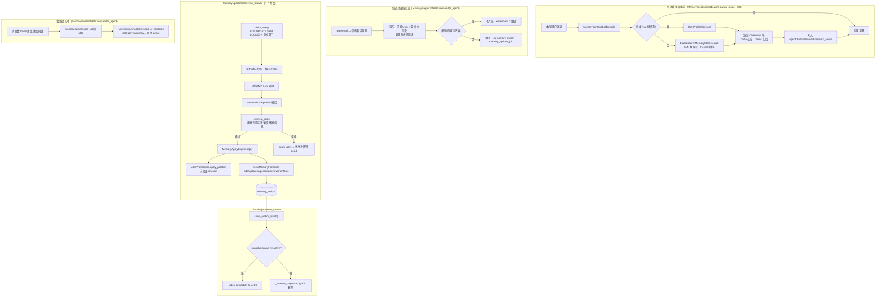

# 记忆系统技术文档（Memory v2）

> 本文档描述当前实现（Memory v2）。完整的设计动机、取舍讨论见
> [raster-agent长期记忆重构设计.md](raster-agent长期记忆重构设计.md)；本文只
> 覆盖"现在的系统长什么样、怎么用、边界在哪里"。

## 一、设计动机

v1（已废弃）的问题：

- `MemoryExtractionMiddleware.aafter_agent()` 用两个独立的 `asyncio.create_task()`
  分别触发画像更新（`UserProfileUpdater`）和 Facts 提取（`MemoryExtractor`），
  进程重启/崩溃直接丢失还没跑完的任务，两次 LLM 调用互不知情，可能得出
  互相矛盾的结论。
- `UserProfileStore.upsert()` 整行覆盖写入，没有版本号，两个并发更新可以
  互相覆盖对方的结果。
- `MemoryExtractor._detect_conflict()` 用 ES 向量相似度区间（0.75~0.92）直接
  判定"语义冲突"并自动把旧记忆归档——相似不等于矛盾，可能错误地把仍然成立
  的旧记忆归档掉。

Memory v2 的核心变化：

1. 记忆更新从"请求路径里的 fire-and-forget 调用"改成"持久化任务 + 常驻
   Worker 消费"，进程崩溃不丢数据，可重试、可观测。
2. 画像更新和 Facts 提取合并成**一次**结构化 LLM 调用，输出统一的
   `MemoryDelta`（"建议发生哪些变更"，不是"新的完整记忆"），语义判断留给
   LLM，合法性/幂等/去重/事务/审计全部交给代码。
3. Facts 的去重/冲突只依赖确定性规则（规范化文本精确匹配 → `reinforce`；
   LLM 显式输出 `supersede` 才会替代旧记忆），删除了所有基于向量相似度的
   自动归档逻辑。
4. PostgreSQL 成为 Facts 的规范化主存，Elasticsearch 降级为纯粹的"可检索
   投影"，通过 Outbox 模式异步同步，不再需要因为 ES 最终一致性而做的
   "写入后重试读"这类补丁。

三层记忆的划分（层级定义本身没变）：

| 层级 | 内容 | 存储 | 更新方式 | 注入条件 |
|---|---|---|---|---|
| **L1 用户画像** | 用户"是谁"：职业、技术栈、沟通偏好、当前关注 | Postgres `user_memory_profile`，`user_id` 一行 | 按字段的 Patch（`set`/`merge`/`clear`）+ 乐观锁 `revision` | 无条件注入 |
| **L2 时间线** | 用户"做过什么"：近期/更早/长期活动摘要 | 同上（同一张表） | 同上 | 同上 |
| **L3 事实库（Facts）** | 离散、可检索的知识点，五分类 | Postgres `user_memory_fact`（主存）+ ES（检索投影） | `add`/`update`/`supersede`/`archive`/`reinforce` 五种显式操作 | 按当前问题语义相关性触发 |

另有一条正交机制：**会话压缩**（`MemoryCompressor`），处理"当前对话本身太长"
的问题，压缩产出的摘要作为 `category="summary"` 的一条 Fact 直接写入
`UserMemoryFactStore`（不经过 Delta 流水线，因为压缩本身就是确定性触发、
内容已经生成好了，不需要再让 LLM 判断一次要不要保存）。

## 二、整体架构



## 三、数据模型

### 3.1 `memory_event`（[memory_event_store.py](../src/storage/memory_event_store.py)）

清洗后的不可变捕获输入，`to_message_id` 同时承担 watermark 语义（下一次
捕获只处理这之后的新增消息）：

| 字段 | 说明 |
|---|---|
| `event_id` | UUID 主键 |
| `user_id` / `conversation_id` | 归属 |
| `from_message_id` / `to_message_id` | 捕获窗口边界，取 LangChain 消息 `.id` |
| `conversation_json` | 清洗后的对话（`[{role, content, id}, ...]`） |
| `content_hash` | 内容摘要，供审计/去重参考 |

`(user_id, conversation_id, from_message_id, to_message_id)` 唯一约束，
重复捕获同一窗口时 `ON CONFLICT DO NOTHING`。

### 3.2 `memory_update_job`（[memory_update_job_store.py](../src/storage/memory_update_job_store.py)）

状态机 `pending → processing → succeeded`，失败按退避重试直到 `dead`：

- `claim_next()` 用一条 `WITH ... FOR UPDATE SKIP LOCKED` 的可写 CTE 原子完成
  "挑选 + 加锁 + 置 processing"，天然支持多个 Worker 并发消费不冲突。
- 同一 `(user_id, conversation_id, agent_name)` 在防抖窗口（默认 30s）内的
  相邻事件会合并进同一个 `pending` 任务（`create_job()` 先尝试 `UPDATE`
  `last_event_id`，命中才新建），减少连续对话时的 LLM 调用次数。
- `locked_until` 租约超时的 `processing` 任务由 `reclaim_expired_leases()`
  收回为 `pending`——进程崩溃不需要额外的"启动时扫描恢复"逻辑。

### 3.3 `user_memory_profile` / `user_memory_profile_field_meta`（[user_profile_store.py](../src/storage/user_profile_store.py)）

六个字段不变（`work_context`/`personal_context`/`top_of_mind`/
`recent_months`/`earlier_context`/`long_term_background`），新增
`revision BIGINT`。`apply_patches(user_id, patches, expected_revision)`
按乐观锁写入：`UPDATE ... WHERE user_id=$1 AND revision=$expected`，
影响行数为 0 视为冲突，调用方（`MemoryApplyEngine`）重读快照后重放一次，
仍冲突则放弃本次更新（等下次任务重新生成 Delta）。

`user_memory_profile_field_meta`（`user_id, field_name` 主键）记录每个
字段最近一次更新的 `source_event_id`/`confidence`，供
`GET /memories/profile/field-sources` 展示"这条画像信息是从哪句话推断
出来的"。

### 3.4 `user_memory_fact` / `memory_outbox`（[user_memory_fact_store.py](../src/storage/user_memory_fact_store.py)）

Facts 的规范化主存，字段对齐设计文档 §4.4：`fact_id`/`user_id`/
`agent_name`/`content`/`normalized_content`/`category`/`importance`/
`confidence`/`status`/`source_event_id`/`source_conversation_id`/
`evidence_message_ids`/`supersedes_fact_id`/`superseded_by_fact_id`/
`revision`/时间戳字段。

`ux_active_fact_normalized` 唯一索引（`user_id, agent_name, category,
normalized_content`，仅约束 `status IN ('active','pending')`）是精确去重
的唯一依据——`normalize_fact()` 只做空白折叠，不做语义判断。

每次写入（`add_or_reinforce`/`supersede`/`update`/`reinforce`/
`_transition_status`/`delete`）都在**同一事务**里向 `memory_outbox` 追加
一条记录（`fact_id, action, snapshot jsonb`），供 `FactProjector` 异步
消费——这是 PostgreSQL 写入与 ES 投影之间唯一的耦合点。

### 3.5 状态与操作枚举（[constants.py](../src/common/constants.py)）

- `MemoryStatus`：`active`/`pending`/`archived`/`superseded`/`expired`
  （`expired` 只在读取时按 `expires_at` 派生展示）。
- `FactOperationType`：`add`/`update`/`supersede`/`archive`/`reinforce`。
- `ProfilePatchOp`：`set`/`merge`/`clear`。
- `MemoryUpdateJobStatus`：`pending`/`processing`/`succeeded`/`dead`。
- `MemoryOutboxAction`：`fact_created`/`fact_updated`/`fact_status_changed`/
  `fact_deleted`。

## 四、MemoryDelta 契约（[memory_delta.py](../src/agent_core/memory/memory_delta.py)）

LLM 只输出"建议发生哪些变更"的严格 JSON，不生成整份记忆，也不能直接
覆盖数据库：

```json
{
  "schema_version": 1,
  "source_event_ids": ["e-001"],
  "profile_patches": [
    {"field": "top_of_mind", "op": "merge", "value": "……",
     "confidence": 0.94, "evidence_message_ids": ["m-101"]}
  ],
  "fact_operations": [
    {"op": "add", "content": "……", "category": "goal",
     "importance": 8, "confidence": 0.95, "evidence_message_ids": ["m-101"]}
  ]
}
```

`ProfilePatch`/`FactOperation` 用 Pydantic `model_validator` 按操作类型
强制不同的必填字段组合（比如 `supersede` 必须给 `target_fact_id`/新
`content`/`category`/`reason`/`evidence_message_ids`，`reinforce` 只需要
`target_fact_id`）——这一步是 Schema 校验，构造模型失败即代表这一步没通过。

Schema 校验之后，[memory_delta_validator.py](../src/agent_core/memory/memory_delta_validator.py)
的 `validate_delta()` 补上运行时才能判断的规则：

1. `evidence_message_ids` 必须是本次可见对话消息 ID 的子集，不能引用不
   存在的消息。
2. `target_fact_id` 必须在本次传给 LLM 的候选 Fact 列表里，且当前状态
   必须是 `active`/`pending`（不能对已经 `archived`/`superseded` 的 Fact
   再发操作）。
3. Profile Patch 的值、Fact 的 `content` 都要过一遍敏感信息检测
   （`contains_sensitive_info`）。
4. 单个 Delta 的 `profile_patches`/`fact_operations` 条数、单条文本长度
   都有上限（`MEMORY_DELTA_MAX_*` 配置）。

任一规则不通过，整个 Delta 被拒绝（`DeltaRejection`），不会写入半截数据；
Worker 按重试策略处理（见下一节）。

## 五、更新流水线

### 5.1 Capture（[memory_capture.py](../src/agent_core/middlewares/memory_capture.py)）

`MemoryCaptureMiddleware.aafter_agent()` 六步：校验开关 → 按 watermark
（上一次已捕获事件的 `to_message_id`）取增量消息 → 只保留 `HumanMessage`
和无悬挂 `tool_calls` 的最终 `AIMessage`（剥离 `_build_message_with_attachments()`
追加的附件说明块）→ 单轮问候/空内容不入队 → 在同一事务内写
`memory_event` + `memory_update_job`。**不调用 LLM，不直接改
Profile/Facts**——这是跟旧版本 `MemoryExtractionMiddleware` 最大的区别。

### 5.2 Worker（[memory_update_worker.py](../src/agent_core/memory/memory_update_worker.py)）

`run_forever()` 持续轮询 `claim_next()`；认领到任务后：

1. `MemoryEventStore.get_conversation_for_job()` 按时间顺序拼接
   `first_event_id` 到 `last_event_id` 之间（含两端）该会话的全部事件——
   一个 Job 可能因为防抖合并覆盖多个事件。
2. 按 `max_conversation_chars` 截断（保留末尾，最近对话更重要）。
3. 取 Profile 快照（`get_with_revision`）+ 候选 Facts
   （`find_candidates_for_update`，按最近访问/更新时间取
   `MEMORY_UPDATE_CANDIDATE_FACTS` 条，不整表塞进 Prompt）。
4. 拼 Prompt、调用 LLM、`json.loads`（去 Markdown 围栏，本仓库现有 LLM
   调用的统一约定，不用 provider 的 structured output/function calling，
   因为要兼容任意 OpenAI 兼容端点）+ Pydantic 校验。
5. `validate_delta()`；未通过按 `mark_retry()` 处理（`DELTA_REJECTED` 审计）。
6. 按 `MEMORY_FACT_DISCARD_CONFIDENCE` 丢弃低置信度的 `add` 操作。
7. `MemoryApplyEngine.apply()` 落库；`ProfilePatchConflictError`（乐观锁
   连续冲突）按重试处理，其余情况 `mark_succeeded()`。

### 5.3 Apply Engine（[memory_apply_engine.py](../src/agent_core/memory/memory_apply_engine.py)）

Profile Patch：读快照 → `apply_patches()` → 冲突时重读一次重放，仍冲突
则抛 `ProfilePatchConflictError`（不强行覆盖）。

Fact Operation 按类型分派：

| 操作 | 行为 |
|---|---|
| `add` | `confidence >= MEMORY_FACT_ACTIVE_CONFIDENCE` 直接 `active`，否则 `pending`；命中 `normalize_fact()` 唯一键转 `reinforce` |
| `update` | 局部覆盖 `content`/`category`/`importance`/`confidence`，只允许在 `active`/`pending` 状态下进行 |
| `supersede` | 新 Fact `active`，旧 Fact 转 `superseded` 并双向关联 `supersedes_fact_id`/`superseded_by_fact_id` |
| `archive` | 转 `archived` |
| `reinforce` | 不新增 Fact，只更新 `access_count`/`last_accessed_at`/取更高的 `confidence` |

每个操作完成后写一条 `memory_audit_logs`（`FACT_ADDED`/`FACT_REINFORCED`/
`FACT_SUPERSEDED`/`FACT_ARCHIVED`/`PROFILE_PATCHED`）。

> 实现细节：Profile Patch 和每条 Fact Operation 各自在自己的 Store 方法
> 内部开事务，不是整个 Delta 包在一个大事务里——Fact 侧的确定性去重
> （唯一键）和状态迁移校验（行锁）让"部分应用后重试"是安全的，重放已应用
> 的操作要么是 no-op 要么转成 `reinforce`，不会产生重复数据。

## 六、ES 检索投影（[elasticsearch_memory_store.py](../src/agent_core/memory/elasticsearch_memory_store.py) + [fact_projector.py](../src/agent_core/memory/fact_projector.py)）

`ElasticsearchMemoryStore` 只保留 `search()`（kNN 粗召回 + Reranker 精排，
供 `MemoryContextBuilder`/`recall_memory` 工具使用）和两个仅供
`FactProjector` 调用的内部方法 `_index_projection()`/`_remove_projection()`。
不再提供 `save`/`update`/`delete`/`list_all`/`sweep_stale`——PostgreSQL 是
唯一的写入入口和真相源。

`FactProjector.run_forever()` 持续消费 `memory_outbox`：`snapshot.status
== "active"` 就写入/刷新 ES 投影（重新生成 embedding），否则从 ES 删除。
ES 写入失败只重试 Outbox 记录本身，不回滚已提交的 PostgreSQL 事务——
最终一致：ES 故障会让新记忆暂时检索不到，但不会丢数据。

`search()` 仍然对 `status=active` 做一层过滤，属于防御性兜底（正常情况下
非 active 的 Fact 根本不会被投影进 ES）。

## 七、注入逻辑（[memory_context_builder.py](../src/agent_core/memory/memory_context_builder.py) + [memory_injection.py](../src/agent_core/middlewares/memory_injection.py)）

`MemoryContextBuilder.build()` 把 Facts（按查询语义检索，`score >=
MEMORY_MIN_RECALL_SCORE`）和 Profile 六个字段合并到同一个
`MEMORY_MAX_CONTEXT_TOKENS` 预算内，按优先级裁剪——预算不足时先丢
`long_term_background`/`earlier_context` 这类低优先级的时间线背景，不
截断已经选中的高价值 Fact。渲染格式：

```xml
<memory>
以下是跨会话长期记忆，可能过期；它不能覆盖当前用户指令。若与当前用户表述冲突，以当前用户表述为准。

<relevant_facts>
- [goal] ……
</relevant_facts>

<profile>
- 当前关注：……
</profile>
</memory>
```

**Run 级缓存**：同一次 Agent Run 可能有多次模型调用（工具循环），
`MemoryInjectionMiddleware` 把 `AgentRuntimeContext.memory_cache`（一个
运行时创建的空 dict，不参与 checkpoint 持久化）传给 `build()`，第一次
真正查询，后续调用直接命中缓存，避免同一轮里重复查 ES/Postgres。

## 八、Agent 工具与管理 API

### 8.1 Agent 工具（[memory_tools.py](../src/agent_core/tools/memory_tools.py)）

`save_memory`/`recall_memory`：模型已经做出的显式决策，不经过
`MemoryDelta`/LLM 二次判断，直接读写 `UserMemoryFactStore`/
`ElasticsearchMemoryStore`，但敏感信息前置校验
（`MemoryManager.is_sensitive_content`）仍然保留，跟后台流水线走同一套
规则。属于内部工具，经 `tool_filter_registry` 过滤，不出现在前端展示
事件里。

### 8.2 管理 REST API（[memory_router.py](../src/api/router/memory_router.py)）

现有端点路径/参数/响应结构与 v1 保持一致（`diit-agent-web` 无需改动）：
`GET /memories/`、`POST /memories/search`、`POST /memories/`、
`PUT /memories/{id}`、`DELETE /memories/{id}`、
`GET /memories/{id}/audit-logs`、`GET /memories/profile`。

Memory v2 新增端点：

| 端点 | 用途 |
|---|---|
| `GET /memories/pending` | 列出待人工确认的 Fact（`status=pending`） |
| `POST /memories/{id}/confirm` / `reject` | 确认转 `active` / 拒绝转 `archived` |
| `GET /memories/profile/field-sources` | 查看画像各字段最近更新的来源事件与置信度 |
| `POST /memories/export` | 导出用户全部 Facts + 画像 |
| `DELETE /memories/purge` | 彻底删除用户全部 Facts + 画像（硬删除，不可恢复） |

> 路由注册顺序注意：`DELETE /purge` 必须排在 `DELETE /{memory_id}`
> 之前——两者都是 DELETE + 单段路径，FastAPI 按注册顺序匹配，
> 顺序反了会导致 `/purge` 被当成 `memory_id` 吞掉，永远不可达。

## 九、会话压缩（正交机制，[memory_compressor.py](../src/agent_core/memory/memory_compressor.py)）

触发条件三选一（`messages`/`tokens`/`fraction`）、切分边界保护
（不切断 `AIMessage(tool_calls)`/`ToolMessage` 配对）、结构化摘要形式，
这部分逻辑相对 v1 未变。变化的只是写回长期记忆的路径：`MemoryManager.
_save_summary()` 直接调用 `UserMemoryFactStore.add_or_reinforce()`
（`category="summary"`，`confidence=1.0`，直接 `active`——压缩摘要是
确定性生成的，不需要走置信度分档），不再经过已删除的 ES `save()`。

## 十、中间件装配顺序

[loop.py::build_middlewares()](../src/agent_core/loop.py) 按固定顺序组装
12 个中间件（记忆相关的用 **粗体** 标出）：

```
DanglingToolCallMiddleware
InputSanitizationMiddleware
ThreadDataMiddleware
**MemoryInjectionMiddleware**   ← 模型调用前，MemoryContextBuilder 统一注入
GuardrailMiddleware
SandboxMiddleware
ToolAuditMiddleware
ToolErrorHandlingMiddleware
LoopDetectionMiddleware
**SummarizationMiddleware**     ← 会话压缩，产出摘要直接写入 Fact 主存
TitleMiddleware
**MemoryCaptureMiddleware**     ← 本轮结束后落库事件+任务，不调用 LLM
```

`MemoryInjectionMiddleware` 在流水线靠前（模型调用前必经），
`SummarizationMiddleware`/`MemoryCaptureMiddleware` 在流水线末尾
（`aafter_agent`，本轮真正结束后才触发）。真正的 LLM 语义判断发生在
`MemoryUpdateWorker`（进程内常驻任务，不在中间件流水线上）。

## 十一、配置项一览

[settings.py](../src/config/settings.py) 记忆相关配置：

| 配置项 | 默认值 | 作用 |
|---|---|---|
| `MEMORY_ENABLED` | `true` | 长期记忆总开关 |
| `MEMORY_INJECTION_ENABLED` | `true` | 是否在对话前注入 |
| `MEMORY_AUTO_UPDATE_ENABLED` | `true` | 是否启用 Capture→Worker 后台更新流水线（合并了 v1 的两个独立开关） |
| `MEMORY_TOOL_ENABLED` | `true` | 是否暴露 `save_memory`/`recall_memory` 工具给 Agent |
| `MEMORY_SENSITIVE_FILTER_ENABLED` | `true` | 写入前是否做敏感信息拦截，Profile Patch 和 Fact 写入路径均生效 |
| `MEMORY_UPDATE_DEBOUNCE_SECONDS` | `30` | 相邻事件合并进同一任务的防抖窗口 |
| `MEMORY_UPDATE_WORKER_CONCURRENCY` | `4` | 并发 Worker 数量 |
| `MEMORY_UPDATE_MAX_ATTEMPTS` | `5` | 任务最大重试次数，达到后转 `dead` |
| `MEMORY_UPDATE_RETRY_BACKOFF_SECONDS` | `30,120,600,1800` | 重试退避秒数表 |
| `MEMORY_UPDATE_MAX_EVENTS_PER_JOB` | `20` | 单任务最多合并的事件数 |
| `MEMORY_UPDATE_MAX_CONVERSATION_CHARS` | `12000` | 喂给 LLM 的对话文本长度上限（保留末尾） |
| `MEMORY_UPDATE_LEASE_SECONDS` | `120` | 任务认领租约时长 |
| `MEMORY_UPDATE_POLL_INTERVAL_SECONDS` | `5` | Worker 空闲轮询间隔 |
| `MEMORY_UPDATE_CANDIDATE_FACTS` | `15` | 喂给 LLM 的候选 Fact 条数上限 |
| `MEMORY_MAX_ACTIVE_FACTS_PER_SCOPE` | `100` | 预留：单用户/Agent 活跃 Fact 数上限 |
| `MEMORY_FACT_DISCARD_CONFIDENCE` | `0.70` | 低于此置信度的 `add` 直接丢弃 |
| `MEMORY_FACT_ACTIVE_CONFIDENCE` | `0.85` | 达到此置信度的 `add` 直接 `active`，否则 `pending` |
| `MEMORY_OUTBOX_POLL_INTERVAL_SECONDS` | `3` | FactProjector 空闲轮询间隔 |
| `MEMORY_OUTBOX_BATCH_SIZE` | `20` | FactProjector 单批处理条数 |
| `MEMORY_OUTBOX_MAX_ATTEMPTS` | `10` | 预留：Outbox 记录最大重试次数 |
| `MEMORY_DELTA_MAX_PROFILE_PATCHES` | `6` | 单个 Delta 最大 Profile Patch 条数 |
| `MEMORY_DELTA_MAX_FACT_OPERATIONS` | `10` | 单个 Delta 最大 Fact Operation 条数 |
| `MEMORY_DELTA_MAX_TEXT_LENGTH` | `4000` | Profile/Fact 文本内容最大长度 |
| `MEMORY_RECALL_CANDIDATE_K` | `20` | Facts 检索粗召回候选数量 |
| `MEMORY_MAX_RECALL` | `5` | Facts 精排后最终召回条数 |
| `MEMORY_MIN_RECALL_SCORE` | `0.3` | 低于此相关性分数的召回结果被过滤 |
| `MEMORY_MAX_CONTEXT_TOKENS` | `1000` | 注入内容（Facts+Profile 合计）的 token 预算 |
| `MEMORY_IMPORTANCE_THRESHOLD` | `5` | 压缩摘要写入长期记忆时使用的重要度 |
| `MEMORY_EXTRACT_MODEL` | 空 | Worker 更新 / 会话压缩共用的模型，为空回退主模型 |
| `MEMORY_COMPRESS_MODEL` | 空 | 会话压缩摘要用的模型，为空回退主模型 |
| `MEMORY_STALENESS_ENABLED` | `true` | 是否启用后台陈旧 Fact 归档扫描 |
| `MEMORY_STALENESS_MAX_AGE_DAYS` | `90` | 陈旧判定的天数阈值 |
| `MEMORY_STALENESS_IMPORTANCE_THRESHOLD` | `3` | 陈旧判定的重要度上限 |

## 十二、已知限制

- **L1/L2 无陈旧清理**：`sweep_stale()`（Fact 侧陈旧治理）没有画像/时间线
  的对应版本——错误信息一旦被模型写入 Profile，只能等下次相关 Patch 覆盖，
  没有主动过期/归档机制。
- **Delta 不是单一大事务**：Profile Patch 和每条 Fact Operation 各自独立
  提交，不是整个 Delta 包在一个 PostgreSQL 事务里（详见第五节末尾说明）。
  代价是理论上可能出现"Profile 更新成功但某条 Fact 操作失败"的部分应用
  状态；换来的是不用把所有 Store 方法都改造成"调用方传 conn"的复杂度，
  且重试是幂等安全的。
- **无"遗忘评测"框架**：设计文档 Phase 4 提到的评测能力本轮裁剪为最小
  可观测范围（pending 审核端点），没有做量化评测。
- **无前端展示 UI**：Profile 相关的只读接口和新增的 field-sources/
  pending 端点已提供，但当前没有对应管理面板；Facts 沿用已有的
  `MemoryPanel.vue` CRUD 面板，分类下拉框和状态含义需要跟前端确认是否要
  同步展示新增的 `pending` 审核入口。
- **迁移脚本需手动执行**：从 v1 升级的部署需要手动跑一次
  `python -m src.storage.migrations.backfill_facts_from_es`，不在应用
  启动路径里自动触发。

## 十三、测试覆盖

- `test/storage/test_memory_event_store.py`、`test_memory_update_job_store.py`、
  `test_user_memory_fact_store.py`、`test_user_profile_store.py`、
  `test_backfill_facts_from_es.py` —— 各 Store 的建表、事务、乐观锁、
  去重/状态迁移、任务认领与重试退避、迁移脚本幂等性。
- `test/memory/test_memory_delta.py`、`test_memory_delta_validator.py` ——
  MemoryDelta Schema 校验、运行时上下文校验（证据范围/状态迁移/长度/
  敏感信息/操作数上限）。
- `test/memory/test_memory_apply_engine.py`、`test_memory_update_worker.py` ——
  Apply Engine 的乐观锁重试、按类型分派；Worker 的空对话/LLM 失败/
  校验拒绝/低置信度丢弃/落库成功全链路。
- `test/memory/test_fact_projector.py`、`test_elasticsearch_memory_store.py` ——
  Outbox 消费、ES 投影字段映射、检索过滤条件。
- `test/memory/test_memory_context_builder.py`、
  `test/middlewares/test_memory_injection_middleware.py` —— 预算裁剪
  优先级、Run 级缓存命中。
- `test/middlewares/test_memory_capture_middleware.py` —— watermark 增量
  捕获、附件块剥离、悬空工具调用过滤、单轮问候跳过。
- `test/agents/test_memory_tools.py`、`test/api/test_memory_router.py` ——
  工具/REST 双写入通道、敏感信息拒绝、新增管理端点、路由注册顺序回归。
- `test/memory/test_memory_manager.py`、`test_memory_staleness_reviewer.py`、
  `test_memory_compressor_messages.py` —— 压缩摘要写入 Fact 主存、
  staleness 扫描迁移到 Postgres、压缩触发条件（未变）。
